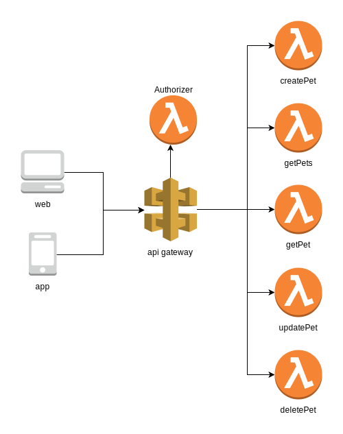

# Peludo Serverless API
Peludo is a platform that helps you to find pets that are missing. This project defines the API used by the mobile apps.

## Running locally
```
npm install
sls dynamodb install
sls dynamodb start
sls offline
```

## Postman collection
There is a postman collection versioned within the repository. You can import it into your Postman in order to perform API tests.

## Software Architecture


